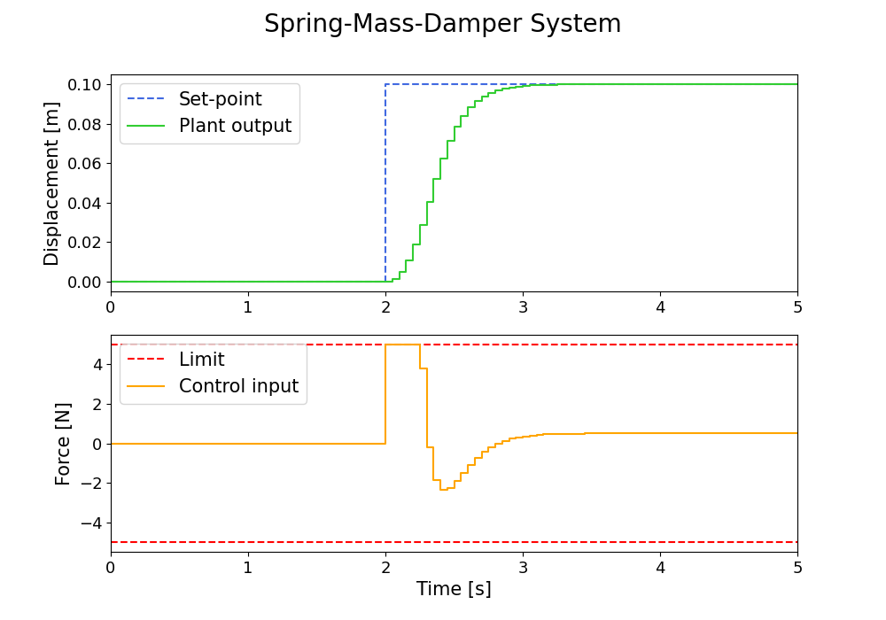

# PFCによるバネ・マス・ダンパ系の位置制御

PFC（Predictive Functional Control）により1自由度バネ・マス・ダンパ系の
位置制御を行います。

オープンループで設計しているため入力制約を設けてもそれなりに上手く制御できます。

## 実行方法

```
$ cargo run && python3 data_plot.py
```

## 実行結果



上図のシミュレーション条件は以下の通り。

【制御対象詳細】
* バネ定数：5 \[N/m\]
* マス質量：5 \[kg\]
* 粘性減衰係数：5 \[Ns/m\]
* 離散化周期：0.05 \[s\]

【PFCの設計パラメータ】
* 基底関数の個数：2
* 一致点の個数：3
* 閉ループ応答時間：0.5 \[s\]
* 制御入力上限：5 \[N\]
* 制御入力下限：5 \[N\]
